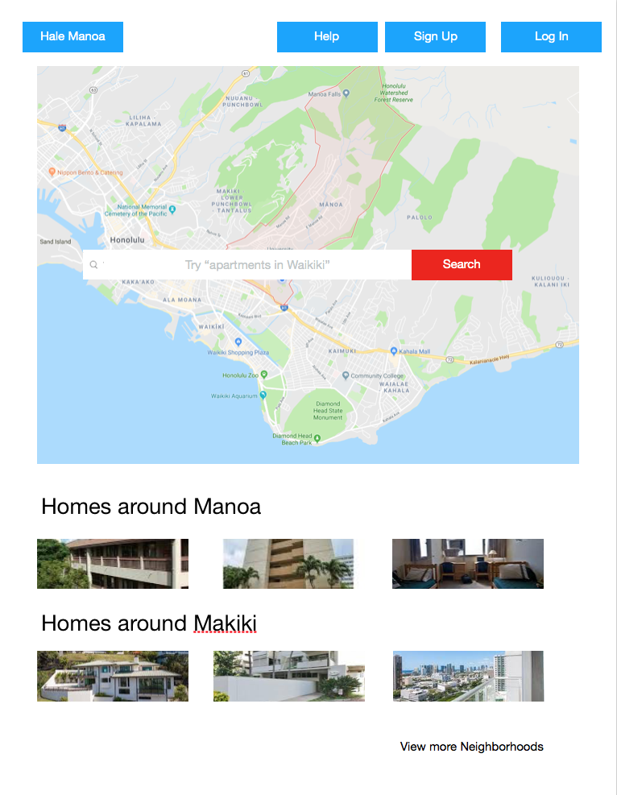
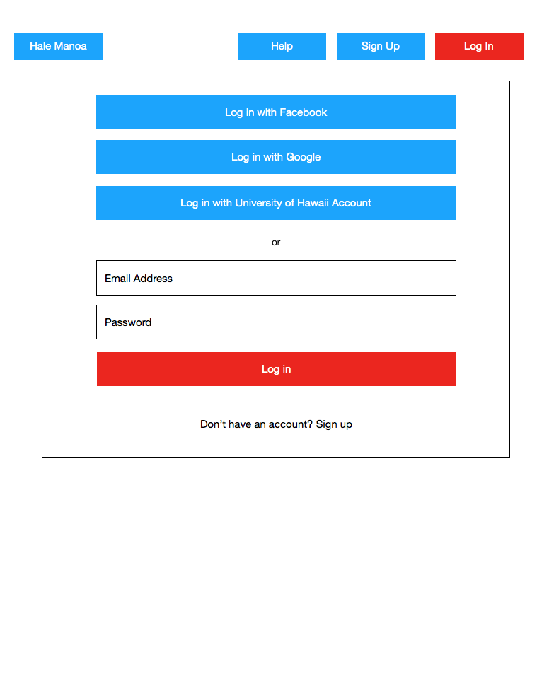
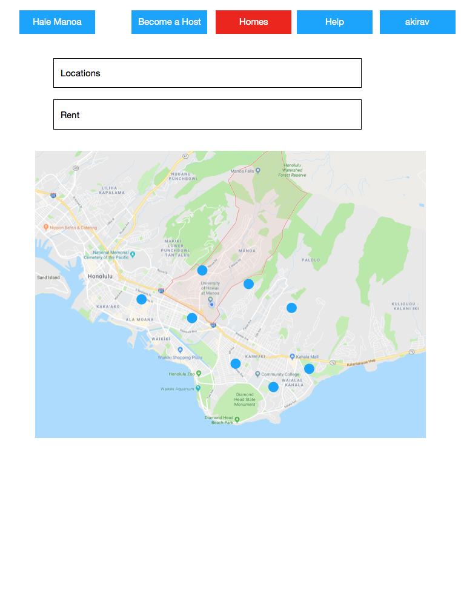
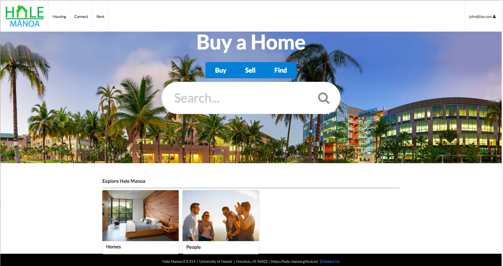
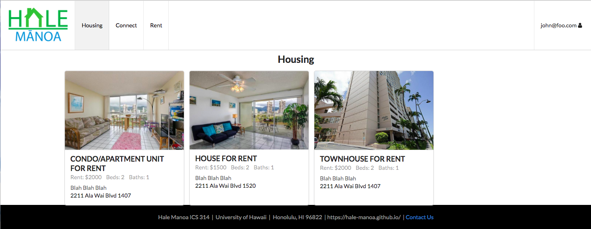
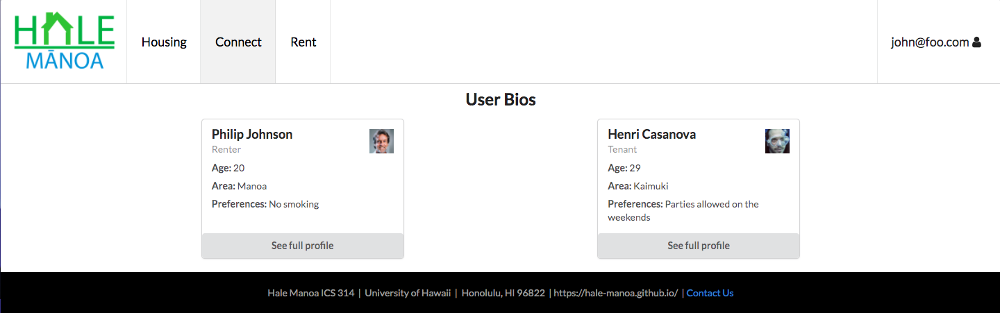
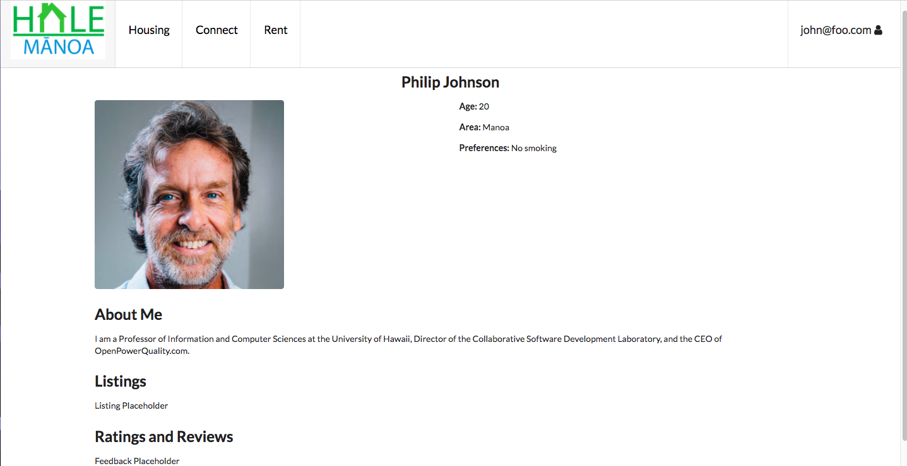

# Table of Contents

* [About Hale Manoa](#about-hale-manoa)
  * [Key Features](#key-features)
  * [Sample Mockup Pages](#sample-mockup-pages)
  * [Guided Tour](#guided-tour)
* [Installation](#installation)
* [Developer's Guide](#developers-guide)
* [Development History](#development-history)

  
# About Hale Manoa
[Hale Manoa]() is a tool for University of Hawaii at Manoa students to browse available and affordable housing options in the area. With Hale Manoa, users are able to directly compare prices and find housing adequate for their needs. Furthermore, local individuals and businesses are able to advertise their housing options while gaining community recognition through reviews given by other users. 

Hale Manoa allows students to find a roommate with similar interests. Students will create their own personal profile with important information such as hobbies, habits, cleanliness, pets, etc. Students can get notified when they have a match. Admins can monitor for inappropriate content and other information.


## [Hale Manoa Web Potral is deployed here: https://halemanoa.meteorapp.com](https://halemanoa.meteorapp.com/)

## Key Features
* Create personalized profiles
* Discover housing options based on specific characteristics
* Compare prices and locations
* Advertise housing options
* Add reviews / community feedback
* Secure login via the UH authentication system

## Sample Mockup Pages 






# Guided Tour
\* Coming Soon *


## Installation 

First, [install Meteor]( https://www.meteor.com/install).

Second, [download a copy of Hale Manoa](https://github.com/hale-manoa/hale-manoa). Note: Hale Manoa is a private repo so permission needs to be granted from the author to gain access. 

Third, cd into the app directory and install the required libraries with: 

```
$ meteor npm install 
```

Once the libraries are installed, you can run the application by invoking: 

```
$ meteor npm run start
```


# Development History

##  Milestone 1: Mockup Development

This milestone started on April 3, 2018 and ended on April 12, 2018

The goal of Milestone 1 was to create a set of HTML pages to provide a mockup for the pages that will be in our application. This mockup was developed as a Meteor app. 

Mockups for the following pages were implemented during M1:

Landing: 



Housing: 



User Bios: 



Profiles:



Milestone 1 was implemented as [Hale Manoa Github Milestone M1](https://github.com/hale-manoa/hale-manoa/projects/1)

## Milestone 2

This milestone started on April 12, 2018 and ended on April 24, 2018. 

The goal for Milestone 2 is to create an MVP (minimum viable project) of our project. We want to finalize our pages and implement basic functionality to be able to utilize most of the aspects of our app. 

Milestone 2 was implemented as [Hale Manoa Github Milestone M2](https://github.com/hale-manoa/hale-manoa/projects/2)

# Contributors
  * [Akira Vernon](https://akirav.github.io/)
  * [Kyle Chan](https://kyle-chan.github.io/)
  * [Arnold Shek](https://arnoldshek.github.io/)
  * [Jonathan Lau](https://jon-lau.github.io/)
  
