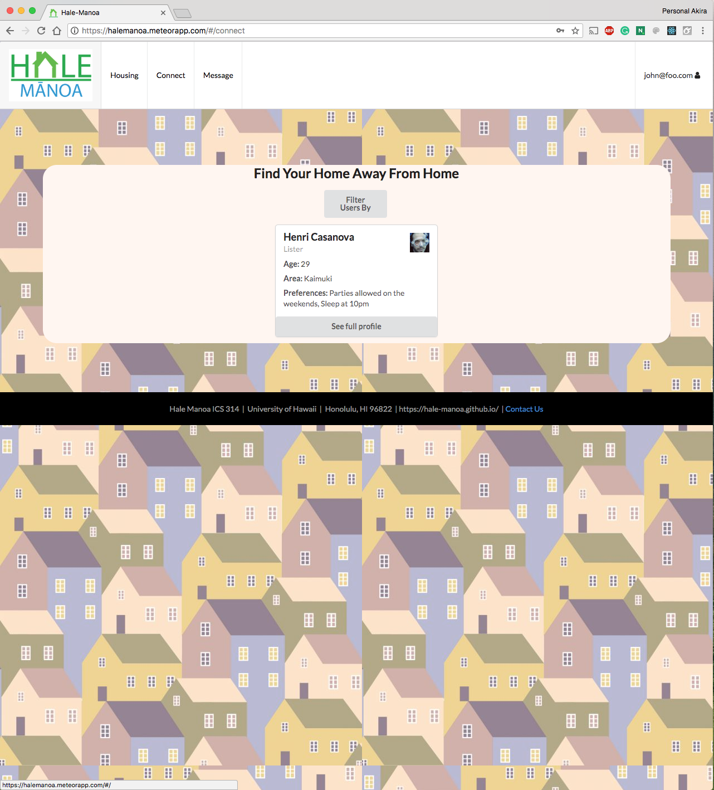

# Table of Contents

* [About Hale Manoa](#about-hale-manoa)
  * [Key Features](#key-features)
  * [Sample Mockup Pages](#sample-mockup-pages)
  * [Guided Tour](#guided-tour)
* [Installation](#installation)
* [Developer's Guide](#developers-guide)
* [Development History](#development-history)


# About Hale Manoa
[Hale Manoa]() is a tool for University of Hawaii at Manoa students to browse available and affordable housing options in the area. With Hale Manoa, users are able to directly compare prices and find housing adequate for their needs. Furthermore, local individuals and businesses are able to advertise their housing options while gaining community recognition through reviews given by other users.

Hale Manoa allows students to find a roommate with similar interests. Students will create their own personal profile with important information such as hobbies, habits, cleanliness, pets, etc. Students can get notified when they have a match. Admins can monitor for inappropriate content and other information.


## Key Features
* Create personalized profiles
* Discover housing options based on specific characteristics
* Compare prices and locations
* Advertise housing options
* Add reviews / community feedback
* Secure login via the UH authentication system


# Guided Tour

Hale Manoa Web Potral is deployed here: [https://halemanoa.meteorapp.com](https://halemanoa.meteorapp.com/)

When you first get to the page, you will be greeted with the landing page. This is shown below.


You will then need to create an account. You can do this by clicking on login at the top right corner and then clicking sign up.


Please enter a valid email and password.

Once logged in you will be greeted with the landing page again, but with more options in the top menu.

The first thing you should do is add your user profile. You can do so by clicking the dropdown on your email in the top right corner then clicking on "my profile". You will be greeted with the following page:


After adding your profile, if you click on "connect" at the top, you will be able to view all of the user profiles that exist in the system. You may filter the users by time (lister or seeker) or by preferences. 


Clicking on the full profile will expand a user's profile for more details. The profile also includes a rating system to rate other users (maybe if they were prior roommates, etc.). 


It also includes a "connect" button, which allows you to connect with the user to send the user a private message. 


Next, you can view the list of off campus housing available for rent. You can do so by clicking the "housing" button at the top. Here, you are able to filter the listings in addition to adding a listing if your user type is "lister". Clicking on "see housing detail" on the listing allows you to view a full listing in addition to a google maps location for the listing. 


The search bar on the landing page does work. You can search for other users or you can search for a listing. Clicking on the search result will either bring you to the listing's page or the user's profile page, depending on what your search result was.


## Developer Guide (Installation)

First, [install Meteor]( https://www.meteor.com/install).

Second, [download a copy of Hale Manoa](https://github.com/hale-manoa/hale-manoa). Note: Hale Manoa is a private repo so permission needs to be granted from the author to gain access.

Third, cd into the app directory and install the required libraries with:

```
$ meteor npm install
```

Once the libraries are installed, you can run the application by invoking:

```
$ meteor npm run start
```

# Initial User Study

##Description of Reviewers of the Website

##Method of Study

##Summary of feedback

# Development History

##  Milestone 1: Mockup Development

This milestone started on April 3, 2018 and ended on April 12, 2018

The goal of Milestone 1 was to create a set of HTML pages to provide a mockup for the pages that will be in our application. This mockup was developed as a Meteor app.

Mockups for the following pages were implemented during M1:

Landing:


Housing:


User Bios:


Profiles:


Milestone 1 was implemented as [Hale Manoa Github Milestone M1](https://github.com/hale-manoa/hale-manoa/projects/1)

## Milestone 2

This milestone started on April 12, 2018 and ended on April 24, 2018.

The goal for Milestone 2 is to create an MVP (minimum viable project) of our project. We want to finalize our pages and implement basic functionality to be able to utilize most of the aspects of our app.

Updated Housing:


Individual Housing:


Edit Housing:


User Bios Search Bar:


User Bios Search Preferences:


Milestone 2 was implemented as [Hale Manoa Github Milestone M2](https://github.com/hale-manoa/hale-manoa/projects/2)

## Milestone 3

This milestone started on April 24, 2018 and ended on May 4, 2018.

The goal for Milestone 3 is to build upon our progress in the previous milestone and further improve functionality. Many improvements were made which include comprehensive filtering for users and housing listings. Geocoding was utilized to visually display listing locations using the Google Maps API. Another significant improvement was the implementation of a real-time messaging interface between users. As the functionality aspects of our project were wrapped up, we transitioned to focus on styling the Hale Manoa site to be aesthetically pleasing. Subtle design patterns and light colors were used to keep styling appealing and minimalistic. 

Landing Page:


List Housing Page:


The "Got a Listing to Add?" button redirects lister type users to the Add Housing Page. This button is conditionally rendered based on user type so seekers will not see this button.

Add Housing Page:


Filtering Housing Listings:


A pop-up modal is used to allow users to filter listings based on various data fields.

Edit Housing:


Individual Housing:


This page displays all information associated with the listing along with a picture. Contact information for the lister is also shown in addition to the listing location on island using the Google Maps API.

Display User Bios:


Filter User Bios:




Similar to the housing filtering, users can also be filtered based on numerous data fields.

View User Profile:


This page displays all information associated with the selected user. Their listings are conditionally rendered depending on their user type. Users can leave rated reviews of each other directly on their profile page.

Messaging Interface:


By clicking the "Connect" button on a user's profile, you can start a private conversation with them. Simply navigate to the "Message" tab and chat away! The messaging interface updates in real time so you will be able to see each other's messages instantly after they are sent.

Milestone 3 was implemented as [Hale Manoa Github Milestone M3](https://github.com/hale-manoa/hale-manoa/projects/3)

# Contributors
  * [Akira Vernon](https://akirav.github.io/)
  * [Kyle Chan](https://kyle-chan.github.io/)
  * [Arnold Shek](https://arnoldshek.github.io/)
  * [Jonathan Lau](https://jon-lau.github.io/)
